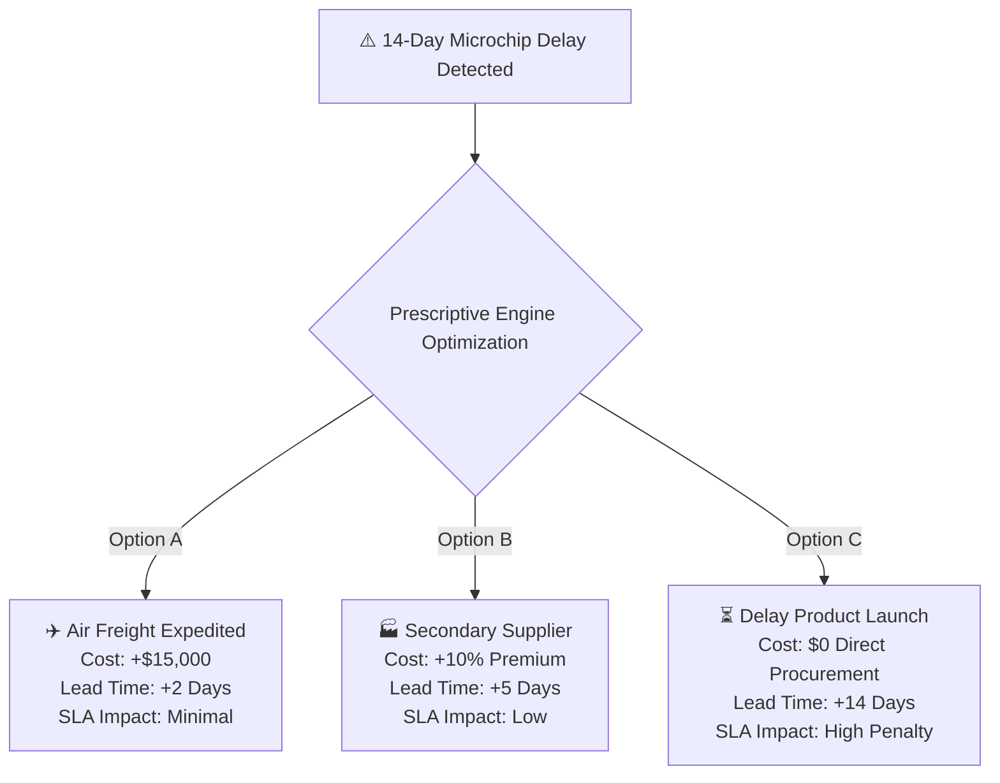

<div align="center">

# 📦 Supply Prescript
### *Closed-Loop Prescriptive Analytics for Resilient Supply Chain Operations*

[](https://www.python.org/)
[](https://fastapi.tiangolo.com/)
[](https://streamlit.io/)
[](https://scikit-learn.org/)
[](https://developers.google.com/optimization)
[](LICENSE)

<br/>

> **Predict ➔ Prescribe ➔ Decide ➔ Execute ➔ Measure ➔ Learn**

<p align="center">
  <a href="#-project-overview">Overview</a> •
  <a href="#-the-closed-loop-paradigm">Core Concept</a> •
  <a href="#-key-features">Key Features</a> •
  <a href="#-system-architecture">Architecture</a> •
  <a href="#-mathematical-formulation">Optimization Model</a> •
  <a href="#-technology-stack">Tech Stack</a> •
  <a href="#-getting-started">Getting Started</a> •
  <a href="#-author">Author</a>
</p>

</div>

---

## 📌 Project Overview

Modern supply chain ecosystems are vulnerable to sudden disruptions—supplier delays, material shortages, carrier capacity bottlenecks, and volatile demand swings. Conventional analytics dashboards typically stop at **predictive detection** (e.g., *"There is an 85% probability of a 14-day microchip delay"*), leaving human operators to guess the optimal mitigation strategy without visibility into trade-offs or actual post-execution performance.

**Supply Prescript** bridges this critical operational gap by unifying:
1. **Predictive Analytics** — Quantifying risks, delay likelihoods, and shortage impacts.
2. **Prescriptive Optimization** — Formulating Linear Programming (LP) and Mixed-Integer models to generate cost-minimized, constraint-aware mitigation alternatives.
3. **Decision Tracking & Operational Execution** — Logging human operator selections and operational contexts.
4. **Outcome Evaluation & Feedback Learning** — Measuring actual cost/time variances post-execution and feeding back empirical data into the optimization engine.

```
       Traditional Analytics                    Supply Prescript (Closed-Loop)
┌─────────────────────────────────┐          ┌──────────────────────────────────┐
│  Data  ➔  Predict  ➔  Dashboard │   VS     │  Data  ➔  Predict  ➔  Prescribe  │
│      (Human guesses action)     │          │    ➔ Decide ➔ Execute ➔ Measure  │
└─────────────────────────────────┘          │          ➔ Feed Forward ↺        │
                                             └──────────────────────────────────┘
```

---

## 💡 The Closed-Loop Paradigm

The platform operates on a continuous learning decision-intelligence cycle:

```text
               ┌──────────────────────────────────────────────┐
               │              Supply Chain Data               │
               │ (ERP, Logistics, Suppliers, Inventory, Demands)│
               └──────────────────────┬───────────────────────┘
                                      │
                                      ▼
               ┌──────────────────────────────────────────────┐
               │           1. Predictive Analytics            │
               │     Detect Disruption, Risk & Delay Lead     │
               └──────────────────────┬───────────────────────┘
                                      │
                                      ▼
               ┌──────────────────────────────────────────────┐
               │           2. Prescriptive Engine             │
               │  Linear / Mixed-Integer Optimization Models  │
               └──────────────────────┬───────────────────────┘
                                      │
                                      ▼
               ┌──────────────────────────────────────────────┐
               │          3. Recommended Alternatives         │
               │       Cost, SLA, Lead Time Trade-offs        │
               └──────────────────────┬───────────────────────┘
                                      │
                                      ▼
               ┌──────────────────────────────────────────────┐
               │             4. Operator Decision             │
               │  Human-in-the-Loop Multi-Criteria Selection  │
               └──────────────────────┬───────────────────────┘
                                      │
                                      ▼
               ┌──────────────────────────────────────────────┐
               │            5. Execution & Audit Log          │
               │   Dispatched Action Stored in Operational DB │
               └──────────────────────┬───────────────────────┘
                                      │
                                      ▼
               ┌──────────────────────────────────────────────┐
               │            6. Outcome Evaluation             │
               │    Expected Cost vs. Actual Cost & Delay     │
               └──────────────────────┬───────────────────────┘
                                      │
                                      ▼
               ┌──────────────────────────────────────────────┐
               │           7. Closed-Loop Feedback            │
               │ Parameter Tuning & Machine Learning Updates  │
               └──────────────────────┬───────────────────────┘
                                      │
                                      └─────────────► [Updates Prescriptive Engine]
```

---

## 🚀 Key Features

| Feature | Description |
| :--- | :--- |
| **🔍 Predictive Risk Detection** | Identifies impending supplier delays, inventory stockouts, transportation bottlenecks, and demand spikes before they escalate. |
| **⚡ Prescriptive Optimization** | Solves cost-minimization problems under capacity, service level, budget, and lead-time constraints using Linear Programming. |
| **📊 Trade-off Action Matrix** | Delivers multi-scenario mitigation plans (e.g., Expedited Air Freight vs. Dual-Sourcing vs. Schedule Adjustment). |
| **📝 Decision Audit Trail** | Logs operator decisions, rationale, context, and estimated metrics into a persistent relational database. |
| **🎯 Post-Execution Measurement**| Calculates cost variances, SLA breach penalties, and actual operational lead times after shipment arrival. |
| **🔄 Self-Calibrating Feedback** | Adjusts cost parameters and penalty coefficients automatically based on real-world variances. |

---

## 🧠 Example Scenario: Microchip Supply Delay

When a predictive model signals a **14-day delay in tier-1 microchip supply**, Supply Prescript immediately evaluates operational mitigation options:



### The Closed-Loop in Action:
1. **Selection:** Logistics Manager selects **Option A (Air Freight)** on the interactive dashboard.
2. **Logged State:** Expected cost of `$15,000` is recorded in the operational database.
3. **Execution & Arrival:** 3 weeks later, the actual invoice arrives at `$18,000` due to fuel surcharges (+$3,000 variance).
4. **Learning Update:** The prescriptive engine updates historical air freight volatility parameters, refining future air freight cost estimates for similar routes.

---

## 🏗️ System Architecture

```text
┌─────────────────────────────────────────────────────────────────────────────┐
│                             DATA INGESTION LAYER                            │
│           ERP Systems  •  WMS Databases  •  Carrier APIs  •  IoT            │
└──────────────────────────────────────┬──────────────────────────────────────┘
                                       │
                                       ▼
┌─────────────────────────────────────────────────────────────────────────────┐
│                         DATA PROCESSING & PIPELINE                          │
│        Data Cleaning  •  Feature Engineering  •  Imputation (Pandas)        │
└──────────────────────────────────────┬──────────────────────────────────────┘
                                       │
                                       ▼
┌─────────────────────────────────────────────────────────────────────────────┐
│                         PREDICTIVE ANALYTICS ENGINE                         │
│       Delay Regression  •  Risk Classifier  •  Stockout Forecasting         │
└──────────────────────────────────────┬──────────────────────────────────────┘
                                       │
                                       ▼
┌─────────────────────────────────────────────────────────────────────────────┐
│                         PRESCRIPTIVE OPTIMIZER                              │
│       Linear Programming (PuLP / OR-Tools)  •  Constraint Validation        │
└──────────────────┬──────────────────────────────────────┬───────────────────┘
                   │                                      │
                   ▼                                      ▼
       ┌────────────────────────┐             ┌────────────────────────┐
       │ Recommendation Matrix  │             │ Cost / Trade-off Model │
       └───────────┬────────────┘             └───────────┬────────────┘
                   └──────────────────┬───────────────────┘
                                      ▼
┌─────────────────────────────────────────────────────────────────────────────┐
│                          DECISION & DASHBOARD UI                            │
│                 Streamlit / React  •  Operator Decision Hub                 │
└──────────────────────────────────────┬──────────────────────────────────────┘
                                       │
                                       ▼
┌─────────────────────────────────────────────────────────────────────────────┐
│                         OPERATIONAL DATABASE & AUDIT                        │
│                   PostgreSQL / MySQL  •  Execution Logger                   │
└──────────────────────────────────────┬──────────────────────────────────────┘
                                       │
                                       ▼
┌─────────────────────────────────────────────────────────────────────────────┐
│                          OUTCOME & FEEDBACK ENGINE                          │
│               Variance Computation  ➔  Model Weight Recalibration           │
└─────────────────────────────────────────────────────────────────────────────┘
```

---

## 📊 Mathematical Formulation

The prescriptive layer optimizes response allocations using a constrained **Linear Programming (LP)** framework:

### Objective Function
$$\text{Minimize } Z = \sum_{i} C_i X_i + \sum_{j} P_j D_j + \sum_{k} S_k A_k$$

Where:
- $X_i$ = Quantity allocated to supply/transportation option $i$ (e.g., air freight, secondary source)
- $C_i$ = Unit cost associated with option $i$
- $D_j$ = Delay duration (in days) for fulfillment route $j$
- $P_j$ = Business penalty per day of customer delivery delay
- $A_k$ = Binary or integer adjustment decisions (e.g., production reschedule)
- $S_k$ = Fixed setup / administrative expense for adjustment $k$

### Subject to Operational Constraints:
$$\begin{aligned}
\sum_{i} X_i &\ge \text{Demand Requirement} && \text{(Fulfillment)} \\
X_i &\le \text{Capacity}_i \quad \forall i && \text{(Supplier / Carrier Capacity)} \\
\sum_{i} C_i X_i &\le \text{Budget}_{\text{max}} && \text{(Capital Limits)} \\
\text{LeadTime}_i &\le \text{MaxAllowableLeadTime} && \text{(SLA Compliance)}
\end{aligned}$$

---

## 🛠️ Technology Stack

| Layer | Technologies | Purpose |
| :--- | :--- | :--- |
| **Language** | `Python 3.9+` | Core platform backend, analytics, and modeling |
| **Data Processing** | `Pandas`, `NumPy` | Data wrangling, pipeline transformations |
| **Predictive ML** | `Scikit-learn`, `TensorFlow`, `XGBoost` | Risk classification and lead-time delay regression |
| **Optimization** | `PuLP`, `Google OR-Tools`, `SciPy` | Linear programming, MIP constraint solvers |
| **Backend API** | `FastAPI`, `Uvicorn`, `Pydantic` | High-performance RESTful API endpoints |
| **Dashboard UI** | `Streamlit`, `React`, `Plotly`, `ECharts` | Interactive operator decision hub & visual analytics |
| **Database** | `PostgreSQL`, `SQLite`, `SQLAlchemy` | Operational state persistence, audit trail & metrics |
| **Testing & CI** | `Pytest`, `GitHub Actions` | Automated unit, regression, and constraint testing |

---

## 📁 Suggested Project Structure

```text
SupplyPrescript/
├── data/
│   ├── raw/                  # Ingested supply chain logs and historical disruptions
│   ├── processed/            # Feature-engineered modeling datasets
│   └── sample/               # Mock data for demonstration and testing
├── models/
│   ├── predictive/           # Trained models (delay regression, classification)
│   └── optimization/         # LP & MIP mathematical formulations
├── src/
│   ├── data_processing/      # Pipeline cleaners and feature builders
│   ├── prediction/           # Inference services for risk/delay detection
│   ├── optimization/         # Prescriptive engine (PuLP / OR-Tools solver)
│   ├── recommendations/      # Trade-off matrix and scenario generators
│   ├── feedback/             # Learning loops & parameter calibration
│   └── evaluation/           # Variance calculations and KPI analytics
├── api/
│   ├── routes/               # API endpoints
│   └── main.py               # FastAPI application entrypoint
├── dashboard/
│   ├── components/           # UI elements and chart visualizers
│   └── app.py                # Streamlit interactive application
├── tests/
│   ├── test_prediction.py    # Unit tests for predictive models
│   ├── test_optimizer.py     # Constraint and solver unit tests
│   └── test_feedback.py      # Feedback loop integration tests
├── requirements.txt          # Python dependencies
├── .env.example              # Environment variables template
├── .gitignore
└── README.md
```

---

## ⚙️ Getting Started

### 1. Clone the Repository
```bash
git clone https://github.com/Nanditha171/SupplyPrescript.git
cd SupplyPrescript
```

### 2. Create and Activate Virtual Environment
```bash
# Windows
python -m venv venv
venv\Scripts\activate

# Linux / macOS
python3 -m venv venv
source venv/bin/activate
```

### 3. Install Dependencies
```bash
pip install --upgrade pip
pip install -r requirements.txt
```

### 4. Configure Environment Variables
Create a `.env` file based on `.env.example`:
```env
DATABASE_URL=sqlite:///./supply_prescript.db
MODEL_PATH=./models/predictive/risk_model.pkl
API_HOST=127.0.0.1
API_PORT=8000
ENVIRONMENT=development
```

### 5. Launch the Platform
Start the FastAPI backend service:
```bash
uvicorn api.main:app --host 127.0.0.1 --port 8000 --reload
```

In a separate terminal, launch the Streamlit decision dashboard:
```bash
streamlit run dashboard/app.py
```

---

## 🧪 Testing & Validation

Execute the test suite across optimization constraints, predictive models, and feedback modules:

```bash
pytest tests/ -v --durations=5
```

---

## 📈 Performance & Evaluation Metrics

```text
┌─────────────────────────┬─────────────────────────┬─────────────────────────┐
│   Predictive Metrics    │  Optimization Metrics   │   Closed-Loop Metrics   │
├─────────────────────────┼─────────────────────────┼─────────────────────────┤
│ • Mean Absolute Error   │ • Total Cost Minimization│ • Cost Variance Delta   │
│ • Root Mean Squared Err │ • Constraint Adherence  │ • SLA Recovery Rate     │
│ • Precision / Recall    │ • Computation Run Time  │ • Model Recalibration Δ │
│ • F1-Score on Shortages │ • Cost Savings vs Naive │ • Decision Follow Rate  │
└─────────────────────────┴─────────────────────────┴─────────────────────────┘
```

---

## 🔮 Future Roadmap

- [ ] **Multi-Objective Optimization (Pareto Fronts):** Simultaneous carbon footprint, cost, and time optimization.
- [ ] **Reinforcement Learning Policies:** Self-learning agent policies for dynamic multi-echelon inventory.
- [ ] **ERP & WMS Real-Time Connectors:** Direct integrations with SAP, Oracle SCM, and Snowflake.
- [ ] **LLM Decision Assistant:** Natural language query interface for root cause and scenario analysis.
- [ ] **Digital Twin Simulation:** High-fidelity discrete-event simulation before real-world execution.

---

## 👥 Target Users & Stakeholders

- **Supply Chain & Logistics Managers** — Optimize expedited shipments and multi-carrier balancing.
- **Procurement & Sourcing Teams** — Evaluate dual-sourcing premiums and supplier risks.
- **Operations Research Analysts** — Formulate, tune, and test supply network optimization constraints.
- **Executive Leadership** — Audit decision efficacy, SLA adherence, and verified cost savings.

---

## 📄 License

This project is licensed under the MIT License — see the [LICENSE](LICENSE) file for details.

---

## 👩‍💻 Author

<div align="center">

### **Nanditha J**
*Artificial Intelligence & Data Science Engineering*

[](https://github.com/Nanditha171)
[](https://portfoliowebsite-one-dusky.vercel.app/)
[](https://github.com/Nanditha171/SupplyPrescript.git)

</div>
