# Supply Prescript — Database Entity Relationship Diagram (ERD)

## Overview

The **Supply Prescript** database schema supports closed-loop prescriptive supply-chain analytics:

$$\text{Predict} \longrightarrow \text{Prescribe} \longrightarrow \text{Decide} \longrightarrow \text{Execute} \longrightarrow \text{Measure} \longrightarrow \text{Learn}$$

---

## Mermaid Entity Relationship Diagram

```mermaid
erDiagram
    PRODUCTS ||--o{ INVENTORY : "stores stock snapshots"
    PRODUCTS ||--o{ SUPPLY_EVENTS : "subject of"
    SUPPLIERS ||--o{ SUPPLY_EVENTS : "supplies for"
    SUPPLY_EVENTS ||--o{ PREDICTIONS : "evaluated by ML"
    SUPPLY_EVENTS ||--o{ OPTIMIZATION_RUNS : "triggers"
    PREDICTIONS ||--o{ OPTIMIZATION_RUNS : "informs"
    OPTIMIZATION_RUNS ||--o{ RECOMMENDATIONS : "generates options"
    RECOMMENDATIONS ||--o{ DECISIONS : "selected in"
    OPTIMIZATION_RUNS ||--o{ DECISIONS : "resolved by"
    DECISIONS ||--o| OUTCOMES : "results in"
    OUTCOMES ||--o{ FEEDBACK : "evaluates variance"
    OPTIMIZATION_RUNS ||--o{ FEEDBACK : "calibrates future runs"

    PRODUCTS {
        int id PK
        string product_code UK
        string product_name
        string product_category
        numeric unit_cost
        string criticality_level
        timestamptz created_at
        timestamptz updated_at
    }

    SUPPLIERS {
        int id PK
        string supplier_code UK
        string supplier_name
        string supplier_country
        float reliability_score
        int supplier_capacity_units
        float average_lead_time_days
        string risk_level
        timestamptz created_at
        timestamptz updated_at
    }

    INVENTORY {
        int id PK
        int product_id FK
        string warehouse_code
        int inventory_units
        int reserved_units
        int available_units
        int reorder_point
        int safety_stock_units
        date inventory_date
        timestamptz created_at
        timestamptz updated_at
    }

    SUPPLY_EVENTS {
        int id PK
        string event_id UK
        int product_id FK
        int supplier_id FK
        date event_date
        int demand_units
        int supplier_capacity_units
        float planned_lead_time_days
        float actual_lead_time_days
        boolean delay_occurred
        float delay_days
        numeric transport_cost
        numeric unit_cost
        numeric secondary_supplier_premium
        numeric air_freight_cost
        float service_risk_score
        timestamptz created_at
    }

    PREDICTIONS {
        int id PK
        int event_id FK
        string model_name
        string model_version
        string prediction_type
        float delay_probability
        float predicted_delay_days
        float risk_score
        string risk_level
        timestamptz prediction_timestamp
        timestamptz prediction_expires_at
        timestamptz created_at
    }

    OPTIMIZATION_RUNS {
        int id PK
        int event_id FK
        int prediction_id FK
        string optimization_run_id UK
        string objective_type
        string optimization_status
        numeric total_cost_baseline
        numeric recommended_cost
        float service_level_target
        float risk_weight
        float cost_weight
        float time_weight
        string solver_name
        string solver_status
        float execution_time_ms
        timestamptz created_at
    }

    RECOMMENDATIONS {
        int id PK
        int optimization_run_id FK
        string recommendation_code
        string strategy_type
        text strategy_description
        numeric estimated_cost
        float estimated_delay_days
        float estimated_risk
        float service_level
        numeric cost_difference
        float risk_difference
        int rank
        boolean is_recommended
        timestamptz created_at
    }

    DECISIONS {
        int id PK
        string decision_id UK
        int optimization_run_id FK
        int recommendation_id FK
        string decision_maker
        string decision_status
        text decision_reason
        timestamptz selected_at
        string execution_status
        timestamptz executed_at
        timestamptz created_at
        timestamptz updated_at
    }

    OUTCOMES {
        int id PK
        int decision_id FK,UK
        numeric actual_cost
        float actual_delay_days
        float actual_service_level
        float actual_risk
        int actual_quantity_delivered
        numeric cost_variance
        float delay_variance
        float service_level_variance
        string outcome_status
        date evaluation_date
        text notes
        timestamptz created_at
    }

    FEEDBACK {
        int id PK
        int outcome_id FK
        int optimization_run_id FK
        string feedback_type
        numeric cost_error
        float delay_error
        float risk_error
        float prediction_error
        float weight_adjustment
        text learning_signal
        timestamptz created_at
    }
```



---

## Closed-Loop Traceability Chain

Every operational outcome maintains full audit lineage:

```text
Supply Event (EVT-001)
     │
     ▼
Prediction (87% delay prob, 14 days)
     │
     ▼
Optimization Run (OPT-001, Balanced Objective)
     │
     ├─► Recommendation ALT_A (Air Freight, $15k, Rank 1, Recommended)
     ├─► Recommendation ALT_B (Secondary Supplier, $22k, Rank 2)
     └─► Recommendation ALT_C (Delay Launch, $0k, Rank 3)
     │
     ▼
Manager Decision (DEC-001: Selected ALT_A, Approved)
     │
     ▼
Actual Execution & Outcome (Actual Cost: $18k, Delay: 2 days, Cost Variance: +$3k)
     │
     ▼
Feedback (COST_VARIANCE: Adjust APAC jet fuel parameter +20%)
     │
     └─► Closes loop to calibrate future optimization runs
```
