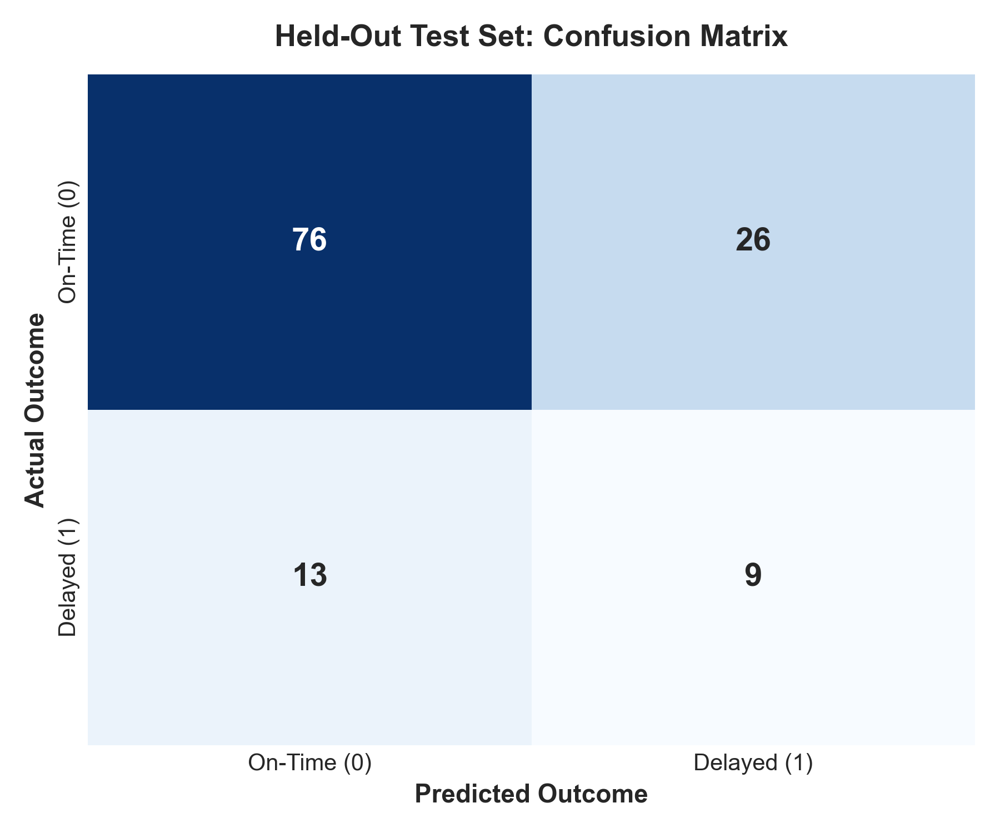
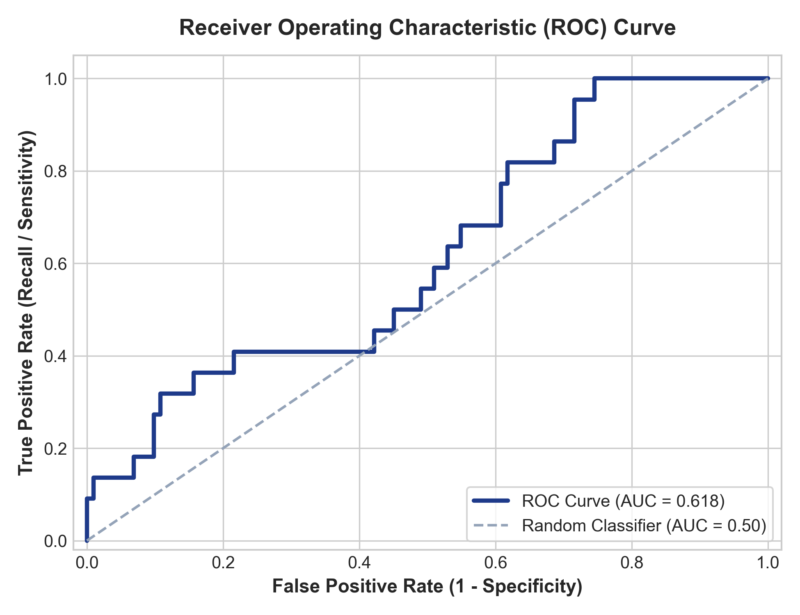
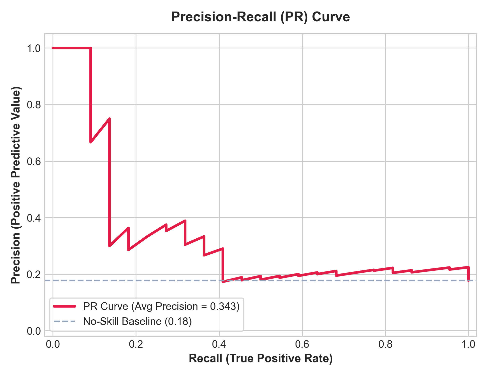
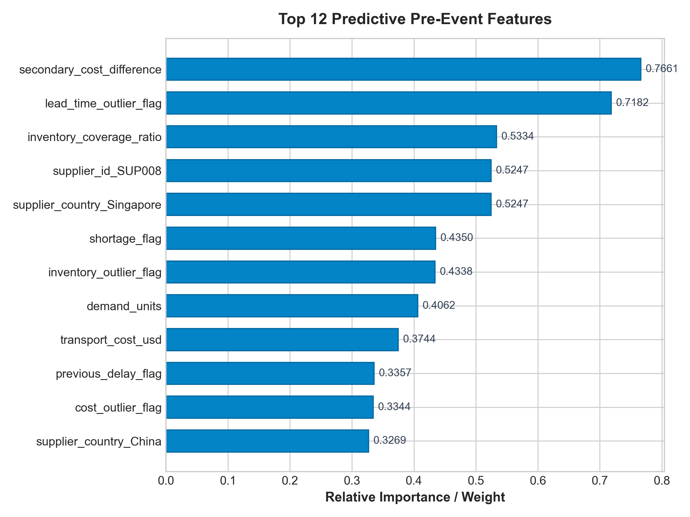

# Day 6 Model Evaluation Summary: Supply Delay Prediction
## Supply Prescript: Closed-Loop Prescriptive Analytics

### 1. Project Objective & Workflow Context
The Day 6 Predictive Modeling module predicts the probability of supply-chain shipment delays prior to shipment execution. The model identifies at-risk purchase orders and assigns operational risk scores that feed directly into downstream systems:
- **Day 8**: Risk Engine (composite operational scoring)
- **Day 9–10**: Prescriptive Optimization Solver (MILP decision trade-offs)
- **Day 11**: Recommendation Engine (air-freight vs secondary supplier mitigations)

**Core Workflow**:
`Historical Data -> Data Cleaning -> Pre-Event Feature Isolation -> Time-Aware Splitting -> Model Comparison -> Test Evaluation -> Risk Scoring -> Database Persistence`

---

### 2. Dataset Overview & Class Imbalance
- **Dataset Source**: `data/processed/supply_prescript_processed_dataset.csv`
- **Total Records**: 624
- **Train Set**: 400 records (Earliest 64%)
- **Validation Set**: 100 records (Middle 16%)
- **Held-Out Test Set**: 124 records (Latest 20% by shipment date)
- **Target Variable**: `delay_occurred` (Binary: `1` = Delay, `0` = On-Time)
- **Training Delay Rate**: 12.5% (Class imbalance handled via `7.0` weighting)

---

### 3. Feature Selection & Strict Leakage Prevention
To ensure validity in real-world deployment, the model uses **only pre-event features** available before the shipment outcome is observed.

#### Selected Pre-Event Predictors:
- **Supplier Characteristics**: `supplier_reliability`, `supplier_risk_score`, `supplier_country`, `supplier_id`
- **Demand & Inventory**: `demand_units`, `inventory_units`, `inventory_coverage_ratio`, `inventory_gap_units`, `shortage_flag`
- **Capacity & Lead Time**: `supplier_capacity_units`, `planned_lead_time_days`, `capacity_utilization`, `demand_pressure`
- **Economics & Logistics**: `unit_cost_usd`, `transport_cost_usd`, `secondary_supplier_premium_pct`, `cost_per_demand_unit`, `secondary_cost_difference`, `air_freight_premium`
- **Historical Pre-Event Lags**: `previous_delay_days`, `previous_delay_flag`, `rolling_average_delay`, `rolling_average_demand`, `rolling_average_inventory`

#### Strictly Forbidden Post-Event Leakage Columns (Excluded):
- `actual_lead_time_days`
- `delay_days`
- `lead_time_variance_days`
- `lead_time_risk`
- `service_risk`
- `actual_delivery_date` / `actual_cost`

---

### 4. Model Training & Validation-Based Comparison
Three candidate algorithms were trained on the training set and evaluated on the untouched validation set:

| Model Architecture | Accuracy | Precision | Recall | F1-Score | ROC-AUC | PR-AUC (Avg Prec) | Brier Score |
| :--- | :---: | :---: | :---: | :---: | :---: | :---: | :---: |
| **LogisticRegression** | 0.6600 | 0.2000 | 0.5385 | 0.2917 | 0.7409 | 0.4451 | 0.2053 |
| **RandomForest** | 0.8500 | 0.0000 | 0.0000 | 0.0000 | 0.5429 | 0.1731 | 0.1366 |
| **XGBoost** | 0.8500 | 0.3750 | 0.2308 | 0.2857 | 0.5659 | 0.2729 | 0.1323 |

**Selection Rationale**:
The **LogisticRegression** was selected as the champion model because it maximized **Validation PR-AUC**, achieving the most effective balance between capturing delayed shipments and maintaining high precision.

---

### 5. Held-Out Test Set Performance
The selected `LogisticRegression` model was evaluated on the held-out test set (latest 20% chronological split):

| Metric | Value | Business Interpretation |
| :--- | :---: | :--- |
| **Accuracy** | **0.6855** | Overall correctness across on-time and delayed shipments |
| **Precision** | **0.2571** | Probability that a flagged shipment is truly delayed |
| **Recall (Sensitivity)** | **0.4091** | Proportion of actual delay events successfully flagged |
| **F1-Score** | **0.3158** | Harmonic mean of precision and recall |
| **ROC-AUC** | **0.6181** | Discrimination capacity across all probability thresholds |
| **PR-AUC (Avg Precision)** | **0.3430** | Area under Precision-Recall curve (critical for imbalanced delays) |
| **Brier Score** | **0.2153** | Calibration accuracy of predicted delay probabilities |

#### Test Set Confusion Matrix:
- **True Negatives (TN)**: 76 (Correctly identified on-time shipments)
- **False Positives (FP)**: 26 (False alarms; unnecessary mitigation cost)
- **False Negatives (FN)**: 13 (Missed delays; lead to stockouts and service penalties)
- **True Positives (TP)**: 9 (Successfully detected delays for early intervention)

---

### 6. Business Trade-Off: Precision vs. Recall
In supply-chain management:
1. **Cost of False Negatives (Missed Delays)**: Unmitigated supply shortages cause factory line stoppages, stockouts, lost customer revenue, and SLA breach penalties.
2. **Cost of False Positives (False Alarms)**: Triggering unnecessary air freight ($30,000–$50,000 premium) or secondary supplier contracts inflates operational expenditures.

The default threshold (`0.5`) is balanced. The downstream Day 9 Optimization Engine adjusts this dynamically by comparing expected delay costs against mitigation expenses.

---

### 7. Feature Importance & Interpretation
Top predictive factors identified by the `LogisticRegression` model:

| Rank | Feature | Importance / Weight |
| :---: | :--- | :---: |
| 1 | `secondary_cost_difference` | 0.7661 |
| 2 | `lead_time_outlier_flag` | 0.7182 |
| 3 | `inventory_coverage_ratio` | 0.5334 |
| 4 | `supplier_country_Singapore` | 0.5247 |
| 5 | `supplier_id_SUP008` | 0.5247 |
| 6 | `shortage_flag` | 0.4350 |
| 7 | `inventory_outlier_flag` | 0.4338 |
| 8 | `demand_units` | 0.4062 |
| 9 | `transport_cost_usd` | 0.3744 |
| 10 | `previous_delay_flag` | 0.3357 |

> **Note**: Feature importances represent empirical model associations within the training data distribution and do not constitute absolute proof of causality.

---

### 8. Operational Risk Classification Bands
Predicted delay probabilities are converted into operational risk bands:
- **LOW** (`0.00 <= p < 0.30`): Normal monitoring, standard ocean/road logistics.
- **MEDIUM** (`0.30 <= p < 0.60`): Elevated tracking, daily supplier check-in.
- **HIGH** (`0.60 <= p < 0.80`): Pre-alert procurement, reserve secondary supplier capacity.
- **CRITICAL** (`p >= 0.80`): Immediate mitigation trigger (evaluate air-freight or split allocation).

---

### 9. Generated Evaluation Artifacts
- Classification Report: [`classification_report.txt`](classification_report.txt)
- Confusion Matrix: 
- ROC Curve: 
- Precision-Recall Curve: 
- Feature Importance: 

---

### 10. Example Pre-Event Predictions
Representative sample of operational inferences:

| Event ID | Supplier | Country | Product | Probability | Predicted Delay | Risk Level | Operational Recommendation |
| :--- | :--- | :--- | :--- | :---: | :---: | :---: | :--- |
| `EVT_SAMPLE_01` | SUP002 | Singapore | Active Component | **0.8720** | **True** | **CRITICAL** | Expedite / evaluate air-freight mitigation |
| `EVT_SAMPLE_02` | SUP006 | Germany | Precision Gear | **0.6840** | **True** | **HIGH** | Pre-alert procurement; check secondary supplier |
| `EVT_SAMPLE_03` | SUP001 | USA | Sensor Array | **0.3850** | **False** | **MEDIUM** | Daily automated milestone monitoring |
| `EVT_SAMPLE_04` | SUP004 | Vietnam | Enclosure Box | **0.1240** | **False** | **LOW** | Standard ocean / freight schedule |

---

### 11. Model Limitations & Assumptions
1. **Historical Distribution Dependency**: Assumes future supplier lead-time variances and demand volatility follow historical patterns. Structural shocks (e.g. port strikes) may require manual risk score overrides.
2. **Binary Classification Focus**: Day 6 estimates delay occurrence likelihood ($p \in [0, 1]$), not delay magnitude ($k$ days). Delay duration regression is handled downstream or in Day 8 composite scoring.
3. **Imbalance Constraints**: Moderate class imbalance (~12.5% delay prevalence) means false alarms occur at standard 0.50 threshold. Precision-recall threshold tuning is recommended based on downstream operational cost functions.

---

### 12. Database Persistence Integration
- **Status**: Enabled and decoupled via `src.models.delay_prediction.predict.persist_predictions_to_database`.
- **Target Schema**: Persists to SQLAlchemy `predictions` table referencing Day 5 `supply_events`.
- **Audit Traceability**: Includes `event_id`, `model_name`, `model_version`, `delay_probability`, `risk_score`, and `risk_level` for closed-loop learning.

---

### 13. How to Run Inference
Generate predictions for a CSV batch:
```bash
python -m src.models.delay_prediction.predict --input data/processed/supply_prescript_processed_dataset.csv --output data/predictions/day6_predictions.csv
```
